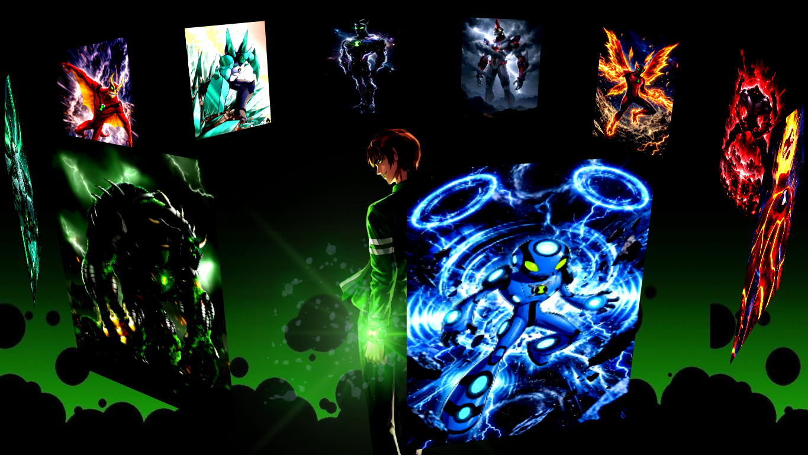

# Ben 10 3D Image Slider


A cinematic **Ben 10 3D image slider** made with pure **HTML and CSS**. This frontend mini project uses CSS custom properties, `transform-style: preserve-3d`, perspective, and keyframe animation to create a rotating carousel of Ben 10 alien artwork.

## Preview



## Live Demo

View the live project:

```text
https://sayedrisat.github.io/3D-image-slider/
```

Open the project locally:

```bash
index.html
```

## Features

- Pure HTML and CSS 3D carousel animation
- Ben 10 themed alien image slider
- Smooth infinite rotation with CSS keyframes
- Custom background and character artwork from the `Ben10-Aliens` folder
- SEO-friendly README with clear project keywords and searchable headings
- Beginner-friendly project structure

## Tech Stack

- HTML5
- CSS3
- CSS transforms
- CSS animations
- CSS custom properties

## Project Structure

```text
3D-image-slider/
+-- README.md
+-- index.html
+-- style.css
+-- Ben10-Aliens/
    +-- ben-bg.png
    +-- ben10.png
+-- assets/
    +-- preview.png
```

## How To Run

1. Clone the repository.
2. Open `index.html` in your browser.
3. Enjoy the rotating Ben 10 3D image slider.

## SEO Keywords

Ben 10 3D image slider, CSS 3D carousel, HTML CSS image slider, rotating image carousel, CSS animation project, frontend mini project, Ben 10 alien slider, pure CSS slider effect.

## Author

Made by [Sayed Risat](https://github.com/sayedrisat).
